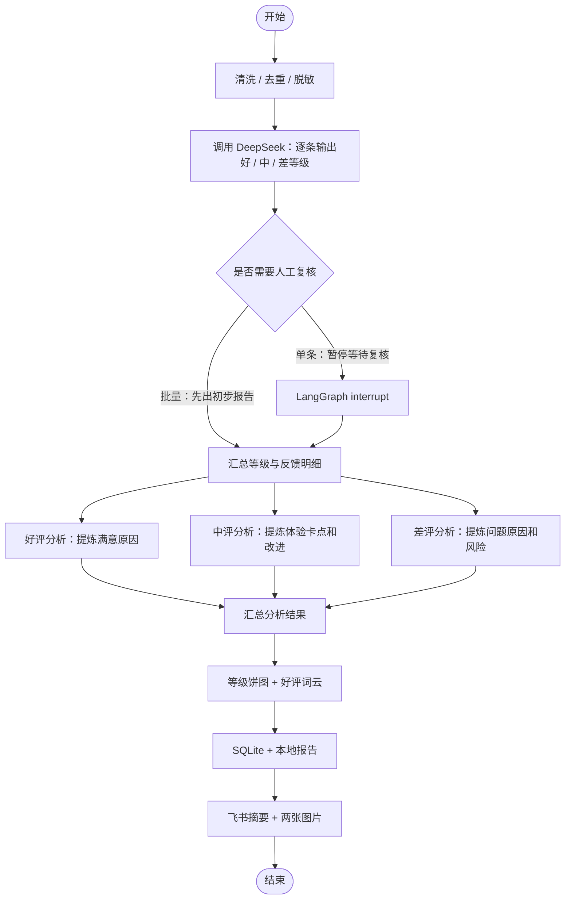

# 厨具 VOC 洞察与闭环 Agent：技术方案

## 当前交付主流程：单产品批量分析

用户在飞书机器人会话中提交单个产品的 Excel/CSV、JSON 文件或 JSON 消息，也可发送多维表格数据表/视图链接。后端通过长连接或 webhook 接收，后台导入后交给 LangGraph 编排模型分类和确定性统计，最终向原会话发送分析摘要、好中差等级饼图和好评词云。

- 输入适配：`app/services/inputs.py` 统一中英文列名、JSON 外层产品和多维表富文本/毫秒日期；`cleaning.py` 读取 Excel/CSV/JSON。不同产品不会混为同一份报告。
- 数据源：`FeishuClient.read_bitable_records` 支持分页、视图筛选及知识库节点解析。应用必须拥有目标表访问权限。
- 任务受理：`RunService` 按消息和会话标识生成运行编号，同一进程内重复事件复用任务；收到消息后立即发送受理回执，导入和模型调用在后台线程运行，异常保存为失败状态。
- 工作流：导入 → 清洗 → 逐条等级评价 → 按好/中/差分组 → 分别分析原因与改进 → 汇总 → 等级饼图/好评词云 → 持久化 → 飞书回传。批量使用 `review_policy=report`，先返回初步结果；单条反馈仍保留暂停逻辑。
- 统计：好中差等级占比分母为完成等级评价的反馈数，排除失败项和重复编号。三个等级分别生成好评原因、中评改进和差评原因；待复核及不可行动记录不生成执行 Issue。
- 输出：`run_reports` 保存结构化报告和投递状态；批次目录保存 `analysis.json`、`analysis.md`、`grade_distribution.png`、`good_wordcloud.png`。摘要、等级饼图和好评词云发送至提交数据的同一会话，发送失败不覆盖已完成的分析。
- 查询：本地 `GET /runs/{run_id}/report` 和 `GET /runs/{run_id}/chart` 可读取结果；公开部署前需要身份及会话权限校验。

后文中的人工复核恢复接口、多维表写回、自动问题单分派和定时周报为扩展设计，不作为当前批量分析主流程的前置条件。

### LangGraph 节点图



当前长连接、队列、事件去重和 checkpoint 均为单进程实现，生产化需补充持久队列与共享 checkpoint。

### Hermes Agent 风格的飞书交互

参考 Hermes Agent 的消息网关、会话键和后台任务设计，本项目将飞书交互拆成四层：

```text
飞书 WebSocket / Webhook
  → 平台适配：解析文本、文件、@、去重
  → 会话路由：chat_id / sender_id 关联最近 run_id
  → 命令与任务：分析、状态、报告、新会话
  → LangGraph 后台运行与结果投递
```

用户发送文件或多维表格链接后立即得到受理消息，模型分析在后台执行；同一聊天可以使用 `/状态` 查询进度，使用 `/报告` 重新获取摘要和图片，使用 `/新会话` 清除当前会话关联。平台适配器不直接参与 LangGraph 节点，任务状态和投递状态统一由运行服务及 SQLite 保存。

当前已落地的命令为：

| 命令 | 作用 |
| --- | --- |
| `/状态` | 查询当前聊天最近一次运行 |
| `/报告` | 重新发送最近一次报告和两张图片 |
| `/状态 <run_id>` | 查询指定运行 |
| `/报告 <run_id>` | 查看指定运行报告 |
| `/新会话` | 清除当前聊天的最近运行 |
| `/帮助` | 返回使用说明 |

Hermes Agent 的流式进度、取消任务和跨平台会话交接属于后续扩展；当前版本先保证飞书长连接下的异步受理、会话关联、状态查询和报告重发。


## 1. 目标与范围

本方案实现一条从客户反馈进入、问题识别、趋势分析、责任分派到处理复盘的可运行链路。首版以面试 Demo 为目标，支持每批 500～5000 条反馈，重点验证 1000 条反馈在 10 分钟内完成分析和写表。

首版包含：

- 飞书机器人接收单条文本反馈和 Excel/CSV 批量文件；
- 反馈清洗、去重、脱敏、分类和严重程度判断；
- 反馈类型数量、占比、趋势和饼图；
- Top 5 问题、原文证据、建议动作和负责人；
- 飞书多维表写入、Issue 通知、人工复核和周报复盘；
- 运行日志、幂等处理、失败重试和结果追溯。

首版不自动执行退款、改价、修改商品页面或其他有副作用的业务操作。

## 2. 总体架构

```text
客户/客服/运营
      │ 文本、文件、运行指令
      ▼
飞书机器人
      │ 事件回调
      ▼
FastAPI 接入层 ──→ SQLite 任务与运行记录
      │                     │
      │                     ▼
      └──────────────→ LangGraph 状态图
                              │
       ┌──────────────────────┼──────────────────────┐
       ▼                      ▼                      ▼
  Python 数据处理       LangChain + LLM          人工复核
       │                      │                      │
       └──────────────→ 聚合、饼图和 Issue ←─────────┘
                              │
                              ▼
                 飞书多维表、群消息、周报
```

FastAPI 只负责接收事件、快速回执、文件下载和任务启动；具体处理由 LangGraph 执行。机器人回调不能长时间等待，因此收到事件后立即返回“已受理 + run_id”，分析任务在后台运行。

## 3. 技术栈与职责

| 模块 | 技术 | 职责 |
| --- | --- | --- |
| 接入层 | Python 3.12、FastAPI、Uvicorn | 飞书事件验签、解析消息、下载文件、回执和状态查询 |
| 工作流 | LangGraph | 状态图、条件分支、批次恢复、重试、人工暂停和恢复 |
| 模型层 | LangChain、OpenAI 兼容模型 | Prompt、结构化输出、模型适配和超时控制 |
| 数据处理 | pandas、pydantic | 清洗、去重、归一化、统计和模型结果校验 |
| 持久化 | SQLite、LangGraph checkpoint | 运行状态、人工复核状态、幂等键和错误日志 |
| 飞书集成 | httpx、飞书开放平台 API | 多维表读写、消息卡片、机器人回执 |
| 图表 | matplotlib、wordcloud、jieba | 好中差等级饼图、好评词云和反馈类型统计 |

Demo 阶段不引入 Redis、消息队列或数据库集群；当任务量和并发量上升时，再将任务表替换为队列和托管数据库。

## 4. 建议目录结构

```text
voice_of_customer/
├── app/
│   ├── main.py                    # FastAPI 应用入口
│   ├── config.py                  # 环境变量和配置
│   ├── api/
│   │   ├── feishu_webhook.py      # 机器人事件回调
│   │   └── runs.py                # 运行状态和复核接口
│   ├── graph/
│   │   ├── state.py               # LangGraph 状态模型
│   │   ├── builder.py              # 图定义和边
│   │   └── nodes.py                # 各处理节点
│   ├── services/
│   │   ├── ingest.py               # 文本/文件解析
│   │   ├── cleaning.py             # 清洗、脱敏、去重
│   │   ├── classify.py             # LangChain 模型调用
│   │   ├── aggregate.py            # 统计和趋势
│   │   ├── chart.py                # 饼图生成
│   │   └── feishu.py               # 飞书接口封装
│   ├── repositories/
│   │   ├── sqlite.py               # 运行、反馈和问题单持久化
│   │   └── bitable.py              # 多维表读写
│   └── prompts/
│       ├── classify.md             # 分类提示词
│       └── issue.md                # 问题单建议提示词
├── tests/
├── scripts/
│   ├── seed_mock.py                # 导入模拟数据
│   └── run_weekly_report.py        # 周报入口
├── mock_feedback_50.csv
├── config/
│   └── taxonomy.yaml               # 分类定义、反例、关键词和版本
├── data/
│   └── benchmark_50.csv            # 50 条人工标注基准集
├── requirements.txt
├── .env.example
└── README.md
```

## 5. 输入协议与标准化

### 5.1 单条反馈

机器人支持自然语言，也推荐使用以下格式：

```text
反馈 SKU=双枪-炒锅-28cm 订单号=MOCK202609150001 内容=用了两个月后开始粘锅，清洗也变困难
```

系统从飞书事件中补齐：

- `feedback_id`：使用飞书消息事件 ID 的稳定哈希；
- `channel`：固定为“飞书机器人”；
- `created_at`：使用事件时间；
- `sku`、`order_id`：从消息字段或文本中解析，无法解析时为空并进入补全或复核队列。

### 5.2 批量文件

用户先发送 `.xlsx` 或 `.csv` 文件，再发送“开始分析”指令。文件至少包含：

```text
feedback_id,text,sku,channel,created_at,order_id
```

文件收到后先保存到临时目录，完成 SHA-256 计算后生成：

```text
run_id = sha256(file_bytes)
```

同一文件重复上传时复用原批次，已完成的反馈不重复分类，已有 Issue 只更新数量和证据。

### 5.3 清洗规则

1. 删除空文本和超过长度上限的异常记录，并在 Run Log 记录原因。
2. 统一时间为 `Asia/Shanghai`，无法解析的时间进入失败记录。
3. 文本规范化：去除多余空白、HTML、重复标点和无意义模板前缀。
4. SKU 做大小写、空格、连接符和常见别名归一化。
5. 对手机号、地址、姓名、订单号等敏感内容做掩码；原始文件只在受限目录短期保存。
6. 以 `feedback_id` 去重；缺失 ID 的批量记录使用“run_id + 行号”生成临时 ID，并标记为待补全。

## 6. LangGraph 状态设计

使用一个批次级 StateGraph。状态只保存可序列化数据，不把客户端对象或大文件内容写入 checkpoint。

```python
class RunState(TypedDict):
    run_id: str
    source_type: Literal["single", "batch"]
    source_ref: str
    status: Literal["received", "running", "waiting_review", "completed", "failed"]
    feedback_ids: list[str]
    records: list[dict]
    classifications: list[dict]
    grade_analyses: dict
    grade_distribution: list[dict]
    review_ids: list[str]
    aggregates: dict
    issue_candidates: list[dict]
    chart_ref: str | None
    grade_pie_ref: str
    good_wordcloud_ref: str
    errors: list[dict]
    counters: dict
```

推荐节点和路由如下：

| 节点 | 处理内容 | 失败处理 |
| --- | --- | --- |
| `load_input` | 读取单条消息或批量文件 | 写入 Run Log，结束批次 |
| `validate_input` | 校验文件类型、列名、大小和行数 | 返回格式错误回执 |
| `clean_records` | 脱敏、去重、时间和 SKU 归一化 | 单行失败隔离，不阻断整批 |
| `classify_batch` | 以 `LLM_CLASSIFY_CONCURRENCY` 控制并发调用 LLM，输出好/中/差等级和问题字段 | 超时或限流重试，失败项隔离 |
| `validate_classification` | Pydantic/JSON Schema 校验字段和枚举 | 最多重试 2 次 |
| `route_review` | 判断低置信度、敏感问题和缺失字段 | 生成复核记录 |
| `wait_human_review` | 使用 `interrupt` 暂停图执行 | 等待复核后恢复 |
| `aggregate_metrics` | 汇总好/中/差等级和问题类别 | 记录聚合错误 |
| `analyze_good` | 分析好评原因 | 模型失败时使用类别统计兜底 |
| `analyze_middle` | 分析中评卡点和改进方向 | 模型失败时使用类别统计兜底 |
| `analyze_bad` | 分析差评原因、风险和优先级 | 模型失败时使用类别统计兜底 |
| `build_report` | 汇总三类分析并生成等级饼图、好评词云 | 保存错误并继续发送可用结果 |
| `build_issues` | 合并相同 SKU/类别问题，生成建议 | 保留候选 Issue |
| `persist_results` | Upsert Feedback、Issue 和 Run Log | API 重试，失败进入错误日志 |
| `notify_feishu` | 发送机器人回执、群卡片和图表 | 通知失败不回滚分析结果 |
| `finalize_run` | 更新批次状态和统计计数 | 保留可重跑状态 |

`route_review` 的结果为“直接继续”或“进入人工复核”。人工复核完成后，通过 `run_id` 和 checkpoint 恢复图执行，避免重复运行已经成功的清洗和分类节点。

## 7. LLM 输出与分类策略

模型只负责理解文本和生成建议，不负责决定工作流状态、是否写表或是否发送通知。每条反馈必须输出结构化 JSON：

```json
{
  "category": "产品质量/涂层",
  "subcategory": "使用两个月后粘锅",
  "sentiment": "负面",
  "severity": "高",
  "is_actionable": true,
  "sku": "双枪-炒锅-28cm",
  "evidence": "使用两个月后开始粘锅",
  "suggested_owner": "品控",
  "suggested_action": "核查同批次涂层投诉，并抽检库存",
  "confidence": 0.91,
  "needs_human_review": false,
  "grade": "差"
}
```

Prompt 必须包含：10 类分类定义、反例、未知类别、严重程度定义、敏感信息禁止回显规则和输出 JSON Schema。以下情况强制复核：

- `confidence < 0.75`；
- 涉及安全事故、伤害、赔付或法律风险；
- 字段缺失、枚举值非法或证据不是原文摘录；
- SKU 无法确认且会影响 Issue 归属。

模型调用设置超时、低温度和最大输出长度；每个批次保留模型名、Prompt 版本、耗时和 Token 统计，便于评估成本和效果。

## 8. 统计与饼图

### 8.1 统计口径

- 按当前批次或周报周期统计有效反馈；
- 按一级问题类别计数；
- “其他/待人工确认”保留为独立类别；
- 占比为 `类别反馈数 / 有效反馈总数`，四舍五入到 1 位小数；
- 人工复核完成后重新计算，图表关联 `run_id`、周期和 Taxonomy 版本。

### 8.2 输出文件

生成：

```text
artifacts/{run_id}/feedback_type_pie.png
artifacts/{run_id}/feedback_type_summary.json
```

`feedback_type_summary.json` 保存类别、数量和占比，PNG 用于飞书消息或周报。反馈类型超过 8 个时，低占比类别可合并为“其他”，但原始明细仍保留在 Feedback 表。

## 9. 飞书机器人与多维表集成

### 9.1 事件处理

1. 在飞书开放平台创建应用并启用机器人能力。
2. HTTP 回调模式配置事件订阅地址 `/webhooks/feishu`；长连接模式由 `app/feishu_long_connection.py` 建立 WebSocket 连接。
3. 两种模式都订阅消息事件，并使用 `event_id` 或消息 ID 去重。
4. 将文本、附件和发送人上下文归一化为项目内部事件格式，写入本地任务表。
5. 立即记录受理状态，后台启动 LangGraph。

HTTP 回调模式的文件下载、表格写入和消息发送由 `FeishuClient` 封装；长连接模式使用 SDK 下载消息资源，出站通知仍复用 `FeishuClient`。两种模式都需要统一处理访问令牌刷新、超时、限流和错误码。

### 9.2 机器人指令

| 指令 | 行为 |
| --- | --- |
| 发送反馈文本 | 创建单条反馈批次 |
| 上传文件 + “开始分析” | 创建批量分析批次 |
| `查询 run_id` | 返回运行状态、计数和错误摘要 |
| `复核 run_id` | 返回待复核记录和处理入口 |
| `生成周报` | 读取已处理 Issue 并生成周期复盘 |

### 9.3 多维表写入

- Feedback：以 `feedback_id` Upsert；
- Issue：以稳定的 `issue_key` Upsert，重复问题累加反馈数并更新证据；
- Taxonomy：保存分类规则和版本；
- Run Log：保存运行状态、输入输出计数、复核数、Token 成本和错误信息。

## 10. 幂等、重试与错误处理

- 文件级幂等：`run_id = sha256(file_bytes)`；
- 消息级幂等：飞书 `event_id` 唯一；
- 明细级幂等：`feedback_id` 唯一；
- Issue 级幂等：`issue_key = sha256(normalized_sku + category + problem_signature)`；
- LLM 调用失败：指数退避，最多 3 次；仍失败则写入失败记录，不影响其他批次；
- 飞书 API 失败：按可重试错误码重试，结果写入成功后再发送通知；
- 单条坏数据：隔离到失败明细，整批继续；
- 批次失败：保留 checkpoint 和错误节点，支持从最近成功节点重跑。

所有异常写入 Run Log，至少包含 `run_id`、节点名、错误类型、错误摘要、重试次数和时间。

## 11. API 设计

```text
POST /webhooks/feishu
  接收机器人事件，返回受理结果

GET /runs/{run_id}
  查询状态、进度、错误、复核数和输出链接

POST /runs/{run_id}/resume
  提交人工复核结果并恢复 LangGraph

POST /runs/{run_id}/weekly-report
  生成指定周期的周报和饼图

GET /healthz
  健康检查
```

复核接口只接受白名单字段和枚举值；权限至少校验飞书用户身份和项目角色。

## 12. 安全与隐私

- App Secret、模型密钥和多维表凭证只放在环境变量或部署平台密钥中；
- Webhook 做签名/来源校验、事件去重和请求体大小限制；
- 原文和脱敏原文分开存储，通知消息只发送必要证据；
- 日志禁止打印完整手机号、地址、姓名、订单号等敏感信息；
- 临时上传文件设置过期清理策略；
- LLM 输出经过 Schema 校验和敏感内容过滤后才能写入飞书；
- 任何退款、改价和页面修改能力不注册为 Agent 工具。

## 13. 部署与运行

### Demo 部署

使用一台可访问公网回调地址的机器或本地隧道：

```text
FastAPI 进程
  ├── webhook 接入
  ├── 状态查询
  └── 后台 LangGraph worker
SQLite 文件
  ├── 运行状态和 checkpoint
  ├── 幂等键
  └── Run Log
```

周报由系统 cron 或 GitHub Actions 调用 `/runs/{run_id}/weekly-report`，使用同一套聚合和图表代码。部署前复制 `.env.example` 为环境配置，启动时执行表结构初始化和健康检查。

### 后续生产化

当并发批次增加或需要多实例时，再拆分 API 和 worker，引入任务队列、PostgreSQL checkpoint、对象存储和集中式日志。业务层 LangGraph 节点接口保持不变。

## 14. 测试与验收

### 单元测试

- CSV/XLSX 字段校验、时间和 SKU 归一化；
- 敏感信息脱敏和反馈去重；
- 分类 JSON Schema、置信度路由和 Issue key；
- 等级统计数量、占比、好评词云和“其他/待人工确认”规则。

### 集成测试

- 使用 mock LLM 验证完整 LangGraph 分支；
- mock 飞书 API 验证 Upsert、通知失败重试和回执；
- 模拟人工复核，确认 interrupt 后能从 checkpoint 恢复；
- 重复发送同一事件和同一文件，确认不重复创建 Feedback/Issue。

### 质量与压力测试

- 100 条人工标注集：分类准确率目标 ≥85%；
- 1000 条混合反馈：端到端成功率目标 ≥95%；
- 结构化字段完整率目标 ≥98%；
- 低置信度和敏感问题拦截率 100%；
- 从机器人受理到 Issue 生成不超过 10 分钟（不含人工复核）；
- 检查结果可由 `feedback_id` 和 `run_id` 追溯。

## 15. 实施顺序

### 第 1 阶段：数据和模型

1. 建立 10 类 Taxonomy 和 50～100 条人工标注集；
2. 完成清洗、去重、聚合和 `mock_feedback_50.csv` 导入；
3. 完成 LangChain 结构化输出、Schema 校验和分类评估。

### 第 2 阶段：LangGraph 主链路

1. 定义 `RunState` 和 checkpoint；
2. 实现文件校验、清洗、分批分类、重试、聚合、Issue 和持久化节点；
3. 加入人工复核 interrupt/resume 和运行日志；
4. 生成好中差等级饼图、好评词云、等级原因分析和 Top 问题结果。

### 第 3 阶段：飞书入口和闭环

1. 接入飞书机器人事件、文件下载和回执；
2. 接入多维表 Upsert、群卡片和负责人通知；
3. 完成运行状态查询、周报和 1000 条压力测试；
4. 补齐 SOP、架构图和演示录屏。

## 16. 关键风险与取舍

- **模型分类不稳定**：用固定 Taxonomy、结构化 Schema、低温度和人工复核降低风险；
- **LLM 延迟或限流**：分批、并发上限、重试和失败隔离保证整批可完成；
- **飞书事件重复投递**：使用 `event_id`、`feedback_id` 和 `run_id` 多层幂等；
- **本地 SQLite 扩展性有限**：只用于 Demo，生产化时替换 checkpoint 和任务存储；
- **饼图误导判断**：保留“其他/待人工确认”，同时展示数量、占比、周期和分类版本；
- **Agent 权限过大**：只提供读取、分析、写表和通知能力，不提供退款、改价等执行工具。
